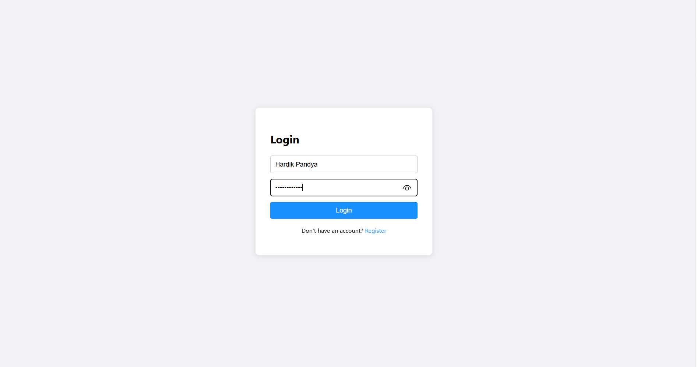
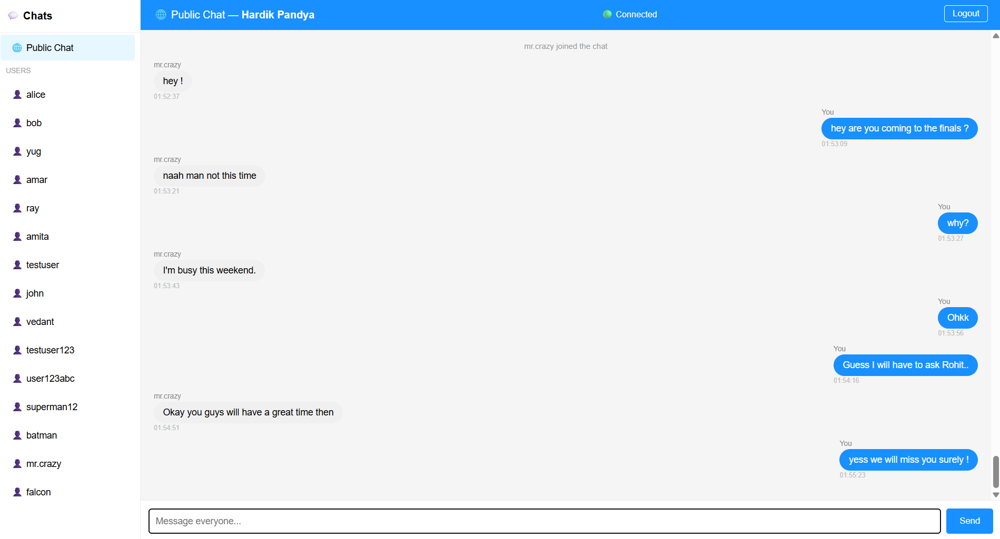
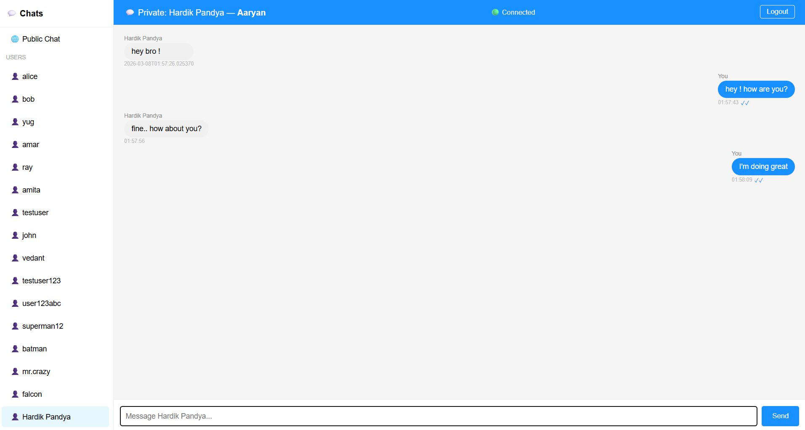

# 💬 Chat App — Frontend

A real-time full-stack chat application built with **React** and **Spring Boot**. This is the frontend repository.

## 🔗 Links
- **Live Site:** https://chat-app-frontend-hazel-six.vercel.app
- **Backend Repo:** https://github.com/yug008/chat-app-backend
- **Frontend Repo:** https://github.com/yug008/chat-app-frontend

---

## 🚀 Features

- **JWT Authentication** — Secure register and login with token-based auth
- **Public Group Chat** — Real-time messaging with all connected users
- **Private Messaging** — One-on-one private conversations
- **Typing Indicators** — See when someone is typing in real-time
- **Read Receipts** — Know when your message has been read (✓ / ✓✓)
- **Chat History** — Public and private messages persist across sessions
- **User List** — See all registered users and start a conversation
- **Auto Scroll** — Chat window scrolls to latest message automatically
- **Logout** — Securely clears session and token

---

## 🛠️ Tech Stack

| Technology | Purpose |
|---|---|
| React | Frontend UI |
| WebSocket (STOMP) | Real-time messaging |
| SockJS | WebSocket fallback for older browsers |
| JWT | Authentication tokens |
| localStorage | Persist login session |
| CSS-in-JS | Inline styling |

---

## 📁 Project Structure

```
src/
├── App.js          # Root component, manages auth state
├── Auth.js         # Login and Register forms
├── Chat.js         # Main chat UI with WebSocket logic
├── index.js        # Entry point
└── App.css         # Global styles
```

---

## ⚙️ Getting Started

### Prerequisites
- Node.js v16+
- Backend server running on `http://localhost:8080`

### Installation

```bash
# Clone the repository
git clone https://github.com/yourusername/chat-app-frontend.git
cd chat-app-frontend

# Install dependencies
npm install

# Install WebSocket libraries
npm install @stomp/stompjs sockjs-client

# Start the app
npm start
```

App runs at `http://localhost:3000`

---

## 🔌 Backend Setup

This frontend connects to a Spring Boot backend. Make sure the backend is running before starting the frontend.

Backend repo: [chat-app-backend](https://github.com/yug008/chat-app-backend)

---

## 📸 Screenshots

### Login


### Public Chat


### Private Chat



---

## 🏗️ Architecture

```
React Frontend (localhost:3000)
        |
        |── REST API (HTTP) ──────────► Spring Boot (localhost:8080)
        |   /api/auth/register                  │
        |   /api/auth/authenticate              │
        |   /api/users                          │
        |   /api/history                        │
        |   /api/conversation                   │
        |                                       │
        └── WebSocket (STOMP/SockJS) ──────────►│
            /ws?username=...                    │
            /app/chat.sendMessage               │
            /app/chat.sendPrivateMessage        │
            /app/chat.typing                    │
            /app/chat.read                      │
            /topic/public  ◄────────────────────│
            /user/queue/private ◄───────────────│
```

---

## 🔐 Authentication Flow

1. User registers/logs in via REST API
2. Backend returns a JWT token
3. Token stored in `localStorage`
4. Token sent as `Bearer` header on all API requests
5. On refresh, token is read from `localStorage` to restore session

---

## 📡 WebSocket Flow

1. After login, React connects to `/ws?username=<username>` via SockJS
2. Subscribes to `/topic/public` for group chat
3. Subscribes to `/user/queue/private` for private messages
4. Sends messages to `/app/chat.sendMessage` or `/app/chat.sendPrivateMessage`

---

## 👨‍💻 Author

**Yug Mehta**  
[GitHub](https://github.com/yug008) 
